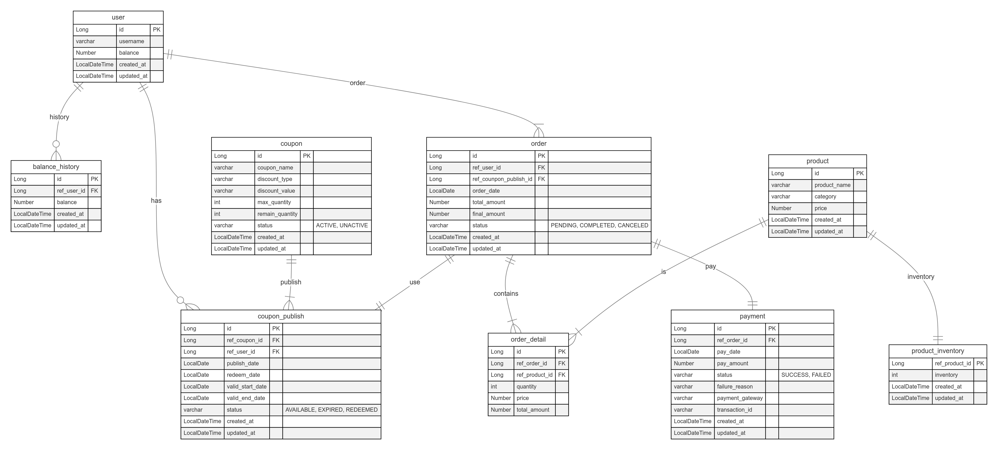

# ERD(Entity Relationship Diagram)

## 테이블 설명
### 1. USER (사용자)
|컬럼명|데이터 타입| 제약 조건 | 설명 |
|---|---|---|---|
|id|Long| PRIMARY KEY | 사용자 ID | 
|username|varchar| NOT NULL | 이름 |
|balance|Number| | 잔액 |
|created_at|LocalDateTime| | 생성 일시 |
|updated_at|LocalDateTime| | 수정 일시 |
### 2. COUPON (쿠폰)
| 컬럼명             | 데이터 타입        | 제약 조건      | 설명                                |
|-----------------|---------------|------------|:----------------------------------|
| id              | 	Long         | 	PRIMARY KEY | 	쿠폰 ID                            |
| coupon_name     | 	varchar      | NOT NULL	         | 	쿠폰 이름                            |
| discount_type   | 	varchar	     | NOT NULL	         | 할인 유형 (FIXED_AMOUNT, FIXED_RATES) |
| discount_value  | 	varchar	     | NOT NULL          | 할인 값 (10%, 5000원)                 |
| max_quantity    | 	int	         |          | 최대 발행 가능 수량                       |
| remain_quantity | 	int	         | 	          | 남은 발행 가능 수량                       |
| status          | 	varchar	     | NOT NULL	          | 쿠폰 활성 상태 (ACTIVE, UNACTIVE)       |
| created_at      | LocalDateTime | NOT NULL           | 생성 일시                             |
| updated_at      | LocalDateTime | NOT NULL           | 수정 일시                             |
### 3. COUPON_PUBLISH (발행 쿠폰)
| 컬럼명              | 데이터 타입        | 제약 조건                   | 설명                                    |
|------------------|---------------|-------------------------|:--------------------------------------|
| id	              |Long| 	PRIMARY KEY   | 	쿠폰 발행 ID                             |                       |
| ref_coupon_id    |	Long| 	FOREIGN KEY , NOT NULL	 | 발행된 쿠폰의 ID (coupon 테이블 참조)            |
| ref_user_id	     |Long| 	FOREIGN KEY, NOT NULL  | 	쿠폰을 발행받은 사용자의 ID (user 테이블 참조)       |
| publish_date     | LocalDate | NOT NULL | 쿠폰 발행일자                               |
| redeem_date      | LocalDate | NOT NULL | 쿠폰 사용일자                               |
| valid_start_date |	LocalDate	| NOT NULL                | 	 유효 시작 날짜                            |
| valid_end_date	  |LocalDate| NOT NULL                | 	 유효 종료 날짜                            |
| status	          |varchar| 	NOT NULL     | 	쿠폰 상태 (AVAILABLE, EXPIRED, REDEEMED) |
| created_at       | LocalDateTime | NOT NULL                        | 생성 일시                                 |
| updated_at       | LocalDateTime | NOT NULL                        | 수정 일시                                 |
### 4. ORDER (주문)
| 컬럼명                   | 데이터 타입         | 제약 조건                    | 설명                                      |
|-----------------------|----------------|--------------------------|:----------------------------------------|
| id                    | 	Long          |	PRIMARY KEY	| 주문 ID                                   |
| ref_user_id           | 	Long          |	FOREIGN, NOT NULL| 	주문을 생성한 사용자의 ID (user 테이블 참조)          |
| ref_coupon_publish_id | 	Long          |	FOREIGN, NOT NULL| 	주문에 사용된 쿠폰의 ID (coupon_publish 테이블 참조) |
| ordered_at            | 	LocalDateTime |	NOT NULL	| 주문 날짜                                   |
| total_amount          | 	Number        |	NOT NULL	| 주문 총액                                   |
| final_amount          | 	Number        |	NOT NULL	| 주문 최종 금액 (쿠폰 적용 후)                      |
| status                | 	varchar	      |	NOT NULL| 주문 상태 (PENDING, COMPLETED, CANCELED)    |
| created_at            | LocalDateTime  |    NOT NULL                      | 생성 일시                                   |
| updated_at            | LocalDateTime  |  NOT NULL                        | 수정 일시                                   |
### 5. ORDER_DETAIL (주문 상세)
| 컬럼명             | 데이터 타입        | 제약 조건                   | 설명                          |
|-----------------|---------------|-------------------------|:----------------------------|
|id	|Long	|PRIMARY KEY| 	주문 상세 ID                   |
|ref_order_id|	Long|	FOREIGN KEY, NOT NULL| 	관련 주문의 ID (order 테이블 참조)   |
|ref_product_id	|Long|	FOREIGN KEY, NOT NULL| 	관련 상품의 ID (product 테이블 참조) |
|quantity|	int	|NOT NULL	| 상품 수량                       |
|price	|Number|	NOT NULL	| 상품 단가                       |
|total_amount|	Number|	NOT NULL	| 상품 총액 (quantity * price)    |
### 6. PRODUCT (상품)
|컬럼명|데이터 타입| 제약 조건 | 설명                                |
|---|---|------------|-----------------------------------|
|id|Long| PRIMARY KEY | 상품 ID                             |
|product_name|	varchar| NOT NULL   | 	상품 이름                            |
|category|	varchar	|    NOT NULL        | 	상품 카테고리 (OUTER, TOP, PANTS, ETC) |
|price|	Number	|  NOT NULL          | 상품 가격                             |
|created_at|LocalDateTime|     NOT NULL       | 생성 일시                             |
|updated_at|LocalDateTime|   NOT NULL         | 수정 일시                             |
### 7. PAYMENT (결제)
| 컬럼명           | 데이터 타입        | 제약 조건                                                               | 설명                        |
|---------------|---------------|---------------------------------------------------------------------|:--------------------------|
|id	|Long| 	PRIMARY KEY	                                                       | 결제 고유 ID                  |
|ref_order_id|	Long| 	FOREIGN KEY, NOT NULL| 	관련 주문의 ID (order 테이블 참조) |
|pay_date|	LocalDate| 	NOT NULL	                                                                  | 결제 날짜                     |
|pay_amount	|Number	| NOT NULL	                                                                   | 결제 금액                     |
|status	|varchar	| NOT NULL	                                                                   | 결제 상태 (SUCCESS, FAILED)   |
|failure_reason|	varchar	| 	                                                                   | 결제 실패 사유 (FAILED 일 경우)    |
|payment_gateway	|varchar| 		                                                                  | PG사                       |
|transaction_id	|varchar| 		                                                                  | 결제 거래 ID                  |
|created_at     | LocalDateTime | NOT NULL                  | 생성 일시                                |
|updated_at     | LocalDateTime | NOT NULL                                                            | 수정 일시                     |
### 8. PRODUCT_INVENTORY (상품 재고)
| 컬럼명            | 데이터 타입        | 제약 조건 | 설명       |
|----------------|---------------|------------|----------|
| ref_product_id | Long          | PRIMARY KEY | 상품 ID    |
| inventory      | int	          |  NOT NULL          | 상품 재고 수량 |
| created_at     | LocalDateTime |     NOT NULL       | 생성 일시    |
| updated_at     | LocalDateTime |   NOT NULL         | 수정 일시    |
### 9. BALANCE_HISTORY (잔액 히스토리)
| 컬럼명         | 데이터 타입        | 제약 조건 | 설명      |
|-------------|---------------|------------|---------|
| id          | Long          | PRIMARY KEY | 히스토리 ID |
| ref_user_id | Long	         |  NOT NULL          | 사용자 ID  |
| balance     | Number	       |  NOT NULL          | 잔액       |
| created_at  | LocalDateTime |     NOT NULL       | 생성 일시   |
| updated_at  | LocalDateTime |   NOT NULL         | 수정 일시   |

## 주요 관계
**1. User <-> CouponPublish (1:N)**
 - 한 사용자는 여러 개의 쿠폰을 발행받을 수 있음.

**2. Coupon <-> CouponPublish (1:N)**
 - 동일한 쿠폰이 여러 사용자에게 발행될 수 있음.

**3. User <-> Order (1:N)**
 - 한 사용자가 여러 번 주문을 할 수 있음.

**4. Order <-> OrderDetail (1:N)**
 - 하나의 주문에 여러 상품이 포함될 수 있음.

**5. Order <-> CouponPublish (1:1)** 
 - **하나의 주문에 하나의 쿠폰만 사용할 수 있음.**

**6. Product <-> OrderDetail (1:N)**
 - 하나의 상품이 여러 주문에서 사용될 수 있음.

**7. Order <-> Payment (1:1)**
 - 하나의 주문에 대해 한 번의 결제만 이루어질 수 있음.

**8. Product <-> ProductInventory (1:1)**
- 상품의 재고가 1:1 관계로 관리됨.

**9. User <-> BalanceHistory (1:N)**
- 사용자의 잔액 충전/사용에 대한 내역이 1:N 으로 관리됨.