# 캐시와 캐싱 전략
## 캐시란?
- 데이터나 값을 미리 복사해 놓는 임시 저장소
- 프로세서가 데이터에 접근할 때 메모리보다 훨씬 빠른 속도로 필요한 정보를 제공함으로써, 시스템의 전반적인 성능을 향상시킨다.
- 캐시를 사용하면 이전에 검색하거나 계산한 데이터를 효율적으로 재사용할 수 있다.

## 캐시의 구조
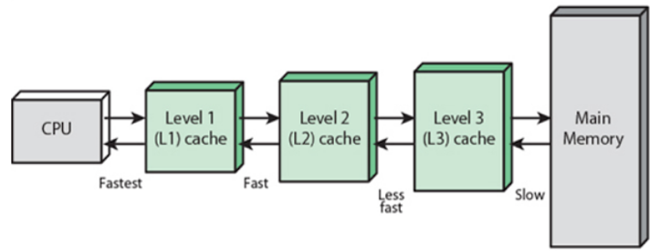
- 캐시는 여러 레벨(L1, L2, L3)로 구성되어 있으며, 각 레벨은 접근 속도와 저장 용량에서 차이를 보인다.
- L1 캐시는 가장 빠르지만 용량이 작고, L3 캐시는 상대적으로 느리지만 더 큰 용량을 가진다.

## 캐시의 작동원리
- 캐시의 핵심 작동 원리는 **지역성(Locality)** 의 원리에 기반한다.   
  ("미리 쓸만한 데이터를 메인 메모리에서 캐시에 옮겨놓자")
- 시간 지역성(Temporal Locality): 한번 참조된 데이터는 잠시 후에 또 참조될 가능성이 높다.
- 공간 지역성(Spatial Locality): 최근에 접근된 데이터의 주변 데이터가 곧 접근될 가능성이 높다.
- 순차적 지역성( Sequential Locality): 비순차적 실행이 아닌 이상 명령어들이 메모리에 저장된 순서대로 실행되는 특성을 고려하여 다음 순서의 데이터가 곧 사용될 가능성이 높다.

# 캐싱 전략
## 캐시 읽기 전략
### 1. Look Aside 패턴 (Cache-Aside) 
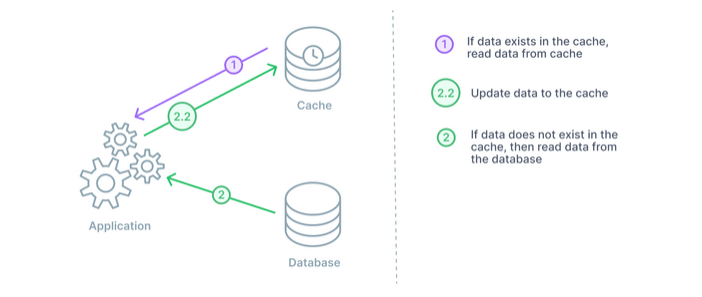
**작동 방식**
1. 애플리케이션은 캐시에서 데이터를 확인한다.
2. 데이터가 캐시에 없으면 데이터베이스에서 데이터를 로드하여 캐시한다.
3. 애플리케이션은 필요할 때(예: 업데이트 후) 캐시 무효화 또는 캐시 새로 고침을 한다.

**사용 사례**
- 애플리케이션 일반적으로 로직이 캐싱 동작을 제어하고 캐시 무효화가 중요한 애플리케이션에서 사용.

**장점**
- 데이터가 캐시되는 시점과 캐시에 유지되는 기간을 보다 유연하게 제어할 수 있다.
- 불필요한 캐싱을 줄인다.
- 캐시에 장애가 발생하더라도 DB에 요청을 전달함으로써 캐시 장애를 대비할 수 있다.

**단점**
- 캐시 무효화는 복잡하고 오류가 발생하기 쉽다.
- 초기 조회 시 무조건 Data Store를 호출 해야 하므로 단건 호출 빈도가 높은 서비스에는 적합하지 않다.
  이런 경우 DB에서 캐시로 데이터를 미리 넣어주는 **Cache warming** 작업을 하기도 한다.

### 2. Read Through 패턴
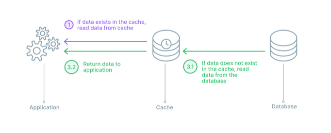  
**작동 방식**
1. 애플리케이션은 먼저 요청된 데이터에 대한 캐시를 확인한다.
2. 데이터가 발견되지 않으면(캐시 미스) 데이터베이스에서 데이터를 읽고 캐시에 저장한 다음 클라이언트로 반환한다.

**사용 사례**
- 데이터를 자주 읽고 캐싱하는 데 도움이 되지만 데이터가 자주 수정되지 않는 경우에 효과적.

**장점**
- 캐시에서 데이터를 제공하여 데이터베이스 부하를 줄인다.
- 캐시와 DB 간의 데이터 동기화가 항상 이루어져 데이터 정합성을 보장한다.

**단점**
- 데이터 조회를 전적으로 캐시에만 의지하므로 redis가 다운될 경우 서비스 이용에 차질이 생길 수 있다.
- 데이터베이스의 데이터가 변경되었으나 캐시가 업데이트되지 않으면 **캐시 불일치**의 가능성이 있다.
- 데이터를 처음 요청하면 항상 캐시 누락이 발생하여 DB 부하가 발생한다.

## 캐시 쓰기 전략
### 1. Write Back 패턴 (Write Behind)
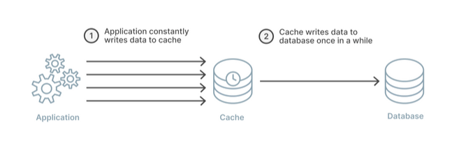  
**작동 방식**
- 데이터가 먼저 캐시에 쓰여지고 특정 기간이나 이벤트 후에 비동기적으로 데이터베이스에 쓰여진다.
- 캐시는 쓰기 버퍼 역할을 한다.

**사용 사례**
- 최종 일관성이 허용되는 높은 쓰기 부하가 있는 애플리케이션에 적합.

**장점**
- 캐시에서 먼저 쓰기를 처리하므로 쓰기 작업이 빠르다.
- 일괄 쓰기를 통해 데이터베이스의 부하를 줄일 수 있다.

**단점**
- 캐시가 데이터베이스와 제대로 동기화되지 않으면 데이터가 손실될 위험이 있다.
- 구현 및 관리가 더 복잡하다.

### 2. Write Through 패턴
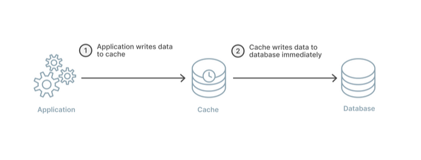  
**작동 방식**
- 데이터가 데이터베이스에 기록될 때마다 캐시도 동시에 업데이트된다. (DB 동기화 작업을 캐시에게 위임)
- 쓰기 작업은 캐시를 거쳐 항상 최신 데이터를 보유하도록 한다.

**사용 사례**
- 캐시와 데이터베이스 간의 데이터 일관성이 중요하고 쓰기 작업이 매우 빈번하지 않은 경우에 적합

**장점**
- 캐시가 항상 최신 데이터로 업데이트되도록 한다.
- 캐시 불일치 문제를 줄인다. (DB와 캐시가 항상 동기화 되어있어 데이터 정합성 보장)

**단점**
- 캐시와 데이터베이스를 모두 업데이트해야 하므로 쓰기 작업이 더 오래 소요된다.
- 쓰지 않는 데이터도 캐시에 저장되어 리소스가 낭비된다.

### 3. Write Around 패턴
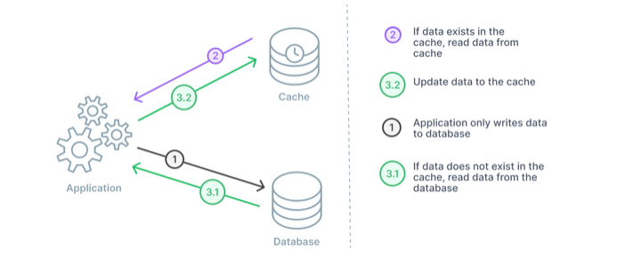  
**작동 방식**
- 새 데이터가 작성되면 캐시가 아닌 데이터베이스에 직접 저장된다.
- Cache miss 가 발생하는 경우에만 DB와 캐시에도 데이터를 저장한다.

**사용 사례**
- 최근에 작성된 데이터를 자주 다시 읽지 않는 애플리케이션에 적합. (예. 실시간 로그, 채팅방 메시지)

**장점**
- 쓰기 작업이 많은 작업 부하에 대한 캐시 변동을 줄인다.
- 자주 액세스하는 데이터에 캐시를 집중시킨다.

**단점**
- 캐시 미스로 인해 쓰기 작업 후 읽기 지연 시간이 증가한다. 주로 Look aside, Read through 와 결합해서 사용한다.
- 캐시와 DB 내 데이터의 불일치 발생 가능.
---
# Cache Stampede (캐시 스탬피드)
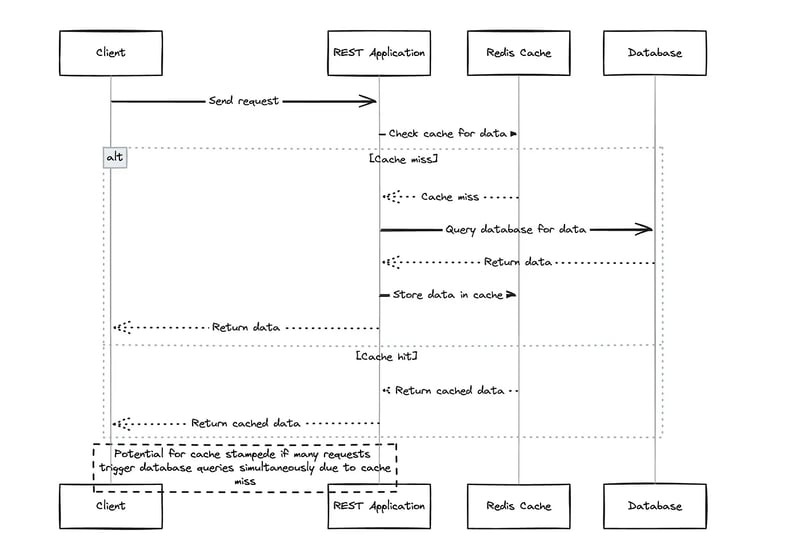
- 대량의 클라이언트가 **캐시 미스(Cache Miss)** 를 경험하고 한꺼번에 백엔드에 데이터를 요청하는 경우 발생하는 현상을 의미한다.
- 결과적으로 요청이 급증하여 **경쟁 상태(Race Condition)** 로 이어지고, 여러 스레드가 동일한 리소스를 놓고 경쟁하게 되어 궁극적으로 서버 부하 증가 및 성능 저하를 초래할 수 있다.

## 해결 방법
### 1. Cache Warming (캐시 워밍)
- 가장 자주 액세스되거나 애플리케이션 성능에 중요한 데이터를 식별하여 이러한 캐시 항목이 만료되기 전에 주기적으로 새로 고침한다.

**장점**
- 캐시 미스 위험을 줄일 수 있다.
- 사용자가 요청한 데이터는 항상 캐시에 준비되어 있으므로 사용자가 최소한의 지연 시간을 경험할 수 있다.

**단점**
- 예상했던 만큼 데이터 요청 빈도가 높지 않으면 불필요한 백엔드 호출과 리소스 사용이 발생할 수 있다.
- 백그라운드에서 캐시를 새로 고치려면 추가적인 컴퓨팅 리소스가 필요하다.

### 2. Jitter
- 캐시 항목의 TTL(Time To Live)을 고정값 대신 일정 범위 내의 무작위(random) 값을 적용하여 설정하는 기법
- 다수의 캐시 항목이 동시에 만료되어 한꺼번에 백엔드(DB)로 요청이 몰리는 캐시 스탬피드 현상을 방지하기 위함이다.  

**장점**
- 단순히 TTL 값에 무작위 변동을 주는 방식이므로, 구현과 적용이 상대적으로 쉽다.
- 모든 캐시 항목의 만료 시간을 고정하지 않고 분산시킴으로써, 동시에 다수의 항목이 만료되는 현상을 효과적으로 완화할 수 있다.

**단점**
- 단순 무작위성만 적용하기 때문에, 시스템의 부하나 실제 사용 패턴에 따른 최적의 TTL 분산을 보장하기 어려움
- 무작위 범위(예: 기본 TTL의 ±X분)를 적절하게 설정하지 않으면, 너무 짧거나 긴 TTL로 인해 오히려 캐시 효율이 떨어질 수 있다.

### 3. PER(Probability-based Expiration Randomization) 알고리즘
- 각 캐시 항목의 TTL에 확률적 요소를 도입하여 개별적으로 만료 시간을 조정하는 방법.  
  각 항목마다 일정 확률을 적용하여 TTL을 변동시킴으로써, 동시에 많은 항목이 만료되는 현상을 완화한다.

**장점**
- 확률적 요소를 도입하여 각 캐시 항목의 TTL을 개별적으로 조정하므로, 동시에 만료되는 현상을 보다 효과적으로 분산시킬 수 있다.
- 시스템의 부하나 트래픽 패턴을 고려한 확률 기반 조정을 적용할 수 있어, 상황에 따라 좀 더 최적화된 TTL 분산이 가능하다.

**단점**
- 단순 무작위 방식에 비해 알고리즘 설계 및 구현이 복잡할 수 있으며, 추가적인 계산이나 파라미터 설정이 필요하다.
- **튜닝 어려움.** 확률적 요소와 관련된 파라미터를 적절하게 설정해야 하는데 환경이나 트래픽에 따라 최적의 값을 찾기 어려울 수 있다.
- 복잡한 계산 로직이 들어갈 경우, 약간의 성능 오버헤드가 발생할 수 있다.
---
## 캐싱 적용 또는 Redis 를 활용한 성능 개선 
### 1. 인기 상품 목록 조회
- **캐싱 전략:**
  - 데이터 변경 빈도가 낮은 경우(일간, 주간 등)에는 정기 배치 작업(예: 하루 한 번의 캐시 웜업)을 통해 캐시를 갱신할 수 있음
  - 실시간성 조회가 필요한 경우에는 1분~5분 간격으로 캐시 웜업을 실행하여 최신 데이터를 유지
- 인기 상품 목록은 조회 빈도가 높고 변경 빈도가 상대적으로 낮은 데이터에 적합하다.  
- 정기 배치 작업을 통해 캐시를 업데이트하거나, 실시간 인기 상품 조회의 경우에는 짧은 주기(1~5분)로 캐시 웜업을 수행하면 DB 부하를 줄이면서도 사용자에게 최신 데이터를 제공할 수 있다.
- **구현**  
  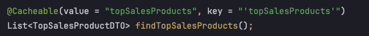
- **실행 결과**  
  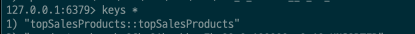
- **테스트 결과**  
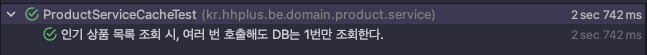

### 2. 상품 목록 조회
- **캐싱 전략:**  
  상품 목록 조회 시 재고와 같이 실시간성이 중요한 정보는 캐시에서 빠르게 읽어오는 `Read Through` 와 함께 캐시가 항상 최신 데이터를 가지도록 하는 `Write Through` 쓰기 전략을 병행한다.  
  이를 통해 사용자는 빠른 응답 속도를 유지하면서도 데이터 일관성을 확보할 수 있다.
- **구현**  
  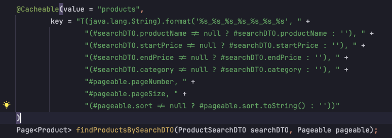
  - 각 검색조건(상품명, 가격조건, 카테고리, 페이징정보)을 키값으로 하여 캐시를 생성한다.
- **실행 결과**  
  - 처음 1번 호출 시   
    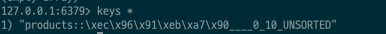
  - 동일한 검색조건으로 2번째 호출 시 - 처음 호출하였을 때 생성된 캐시만 존재  
    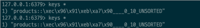
  - 검색조건을 다르게 하여 호출 시 - 새로운 검색조건에 해당하는 캐시 생성  
    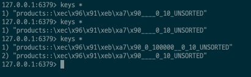
- **테스트 결과**  
  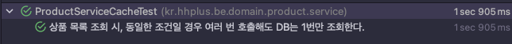

### 3. 선착순 쿠폰 발급
- **Redis 활용 설계:**  
  - Redis 를 활용하여 쿠폰 발급 요청 시 요청 건에 대한 정보를 대기열에 저장한다.  
    대기열에 저장 전 Redis 메모리에 적재된 쿠폰의 잔여수량과 기존에 발급한 사용자 여부를 검증한다.  
    스케줄러를 통해 대기열의 요청 건을 조회하여 쿠폰 발급을 처리한다.
  - 쿠폰 선착순 요청 (`sorted set` 자료구조 활용)
  - 쿠폰 중복발급 방지 (`set` 자료구조 활용)
  - 쿠폰의 잔여수량 검증 (`hash` 자료구조 활용)
- **활용 예시**
  - 쿠폰 잔여수량 (`hash`)  
  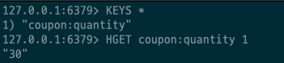
  - 쿠폰 발급 요청 (`sorted set`) 
  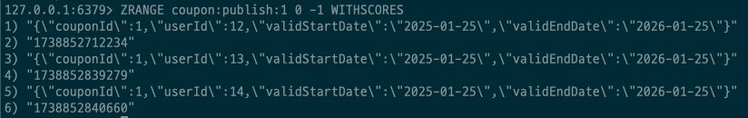
  - 쿠폰 발급 요청 사용자 (`set`)  
  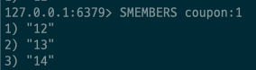

# 참고
- [캐시의 이해와 최적화 전략](https://f-lab.kr/insight/understanding-cache-and-optimization-strategies?gad_source=1&gclid=CjwKCAiAzPy8BhBoEiwAbnM9OwmORDXU5vKyITCqhg9tHR7sOzTxANNjT6i96w4HoAQwcQdJsyj17BoCOB0QAvD_BwE)
- [Cache Memory](https://www.includehelp.com/operating-systems/cache-memory-and-its-different-levels.aspx#google_vignette)
- [Caching strategies](https://www.prisma.io/dataguide/managing-databases/introduction-database-caching)
- [Cache Stampede](https://dev.to/slaknoah/what-is-a-cache-stampede-how-to-prevent-it-using-redis-1l9p)
