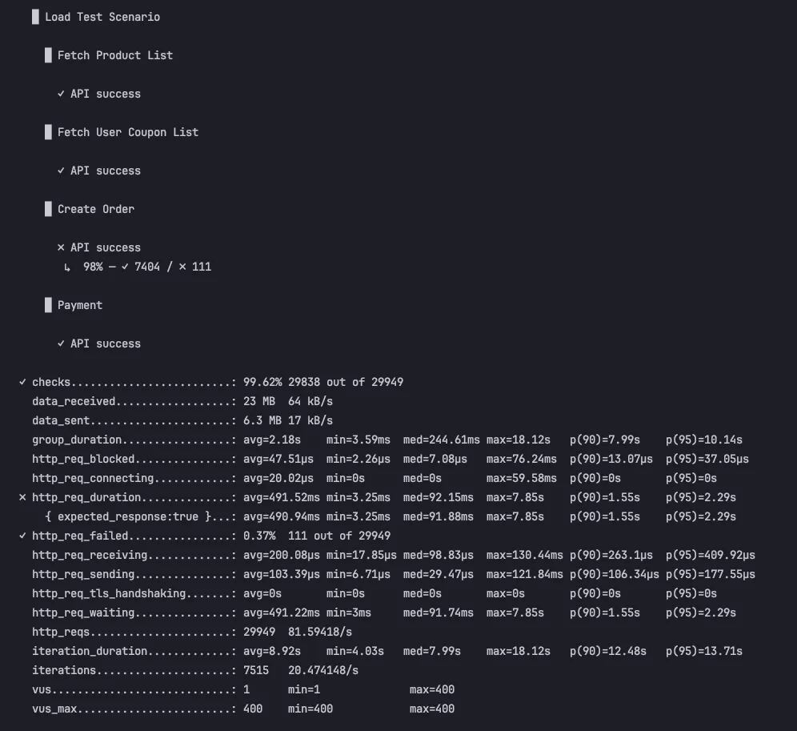
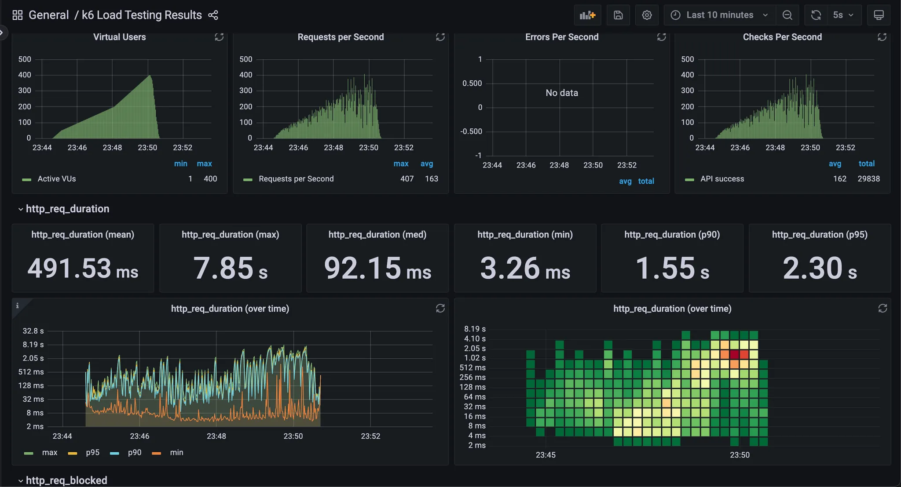
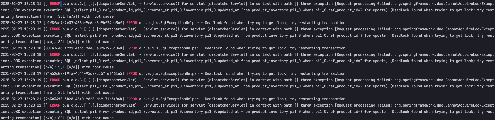

# 성능 테스트 결과 보고서

## 1. 테스트 개요

### **목적**
- 전자상거래 시스템의 **핵심 API(상품 조회, 쿠폰 조회, 주문, 결제)의 성능 및 부하 처리 능력 평가**
- **응답 속도, 오류율, 동시 사용자 처리 성능**을 측정하여 최적화 포인트 도출
- **최대 트래픽 한계점을 파악하여 서버 확장 및 성능 개선 방향 수립**

### **테스트 환경**
- **서버 환경:**
    - **API 서버:** `http://ecommerce-app:8080`
    - **DB:** MySQL 8.0
    - **캐싱:** Redis
    - **Auto Scaling 설정:** 없음 (테스트 결과에 따라 적용 검토)
- **테스트 도구:** K6, InfluxDB, Grafana
- **데이터 시각화:** Grafana 대시보드 활용 (`Dashboard ID: 2587`)

## 2. 테스트 결과
- K6 테스트 실행 결과


| 항목 | 값 | 분석 |
|------|------|------|
| **총 요청 수 (`http_reqs`)** | 29,949 (81.59 req/s) | 높은 트래픽에서도 원활한 처리 |
| **성공률 (`checks`)** | 99.62% (29,838/29,949) | 대부분의 요청 성공 |
| **실패율 (`http_req_failed`)** | 0.37% (111건 실패) | 주문 API에서 일부 실패 발생 |
| **평균 응답 시간 (`http_req_duration`)** | 491.52ms | 예상보다 높은 응답 시간 |
| **최대 응답 시간 (`http_req_duration.max`)** | 7.85s | 일부 요청에서 과도한 지연 발생 |
| **동시 사용자 (`vus_max`)** | 400명 | 계획한 최대 부하까지 테스트 완료 |

- Grafana Dashboard

#### Virtual Users (동시 사용자 수)
- 최대 동시 사용자: **400명**
- 점진적으로 부하가 증가하며, 최대 부하 후 감소하는 패턴

#### Requests Per Second (RPS - 초당 요청 수)
- **최대 RPS:** 407 req/s
- **평균 RPS:** 163 req/s
- 최대 부하에서 407 req/s까지 도달하며, 평균적으로 163 req/s를 유지하며 안정적으로 요청을 처리

#### Errors Per Second (초당 오류 수)
- **데이터 없음 (`No Data`)**
- 오류가 거의 발생하지 않았거나, K6에서 `http_req_failed` 지표가 매우 낮아 표시되지 않은 것으로 보임
- 하지만 **K6 로그에서 주문 API에서 일부 실패(0.37%)가 발생했으므로, 자세한 에러 분석 필요**

#### 응답 시간 히트맵 분석
- 부하가 증가하면서 요청 시간이 점진적으로 길어짐
- 최대 부하에서 일부 요청이 7초 이상 지연됨
- 일부 구간에서 빨간색(긴 응답 시간)이 관찰됨 → 병목 현상 존재 가능성

서버는 400명 동시 접속 부하에서도 안정적으로 동작했으나, 주문 API에서 일부 실패가 발생하였으며, 응답 시간이 길어지는 현상이 관찰되었다.

## 3. API별 성능 분석

| API | 성공률 | 응답 시간 (평균) | 최대 응답 시간 | 분석 |
|------|--------|----------------|----------------|------|
| **상품 조회** | 100% | 빠름 | 문제 없음 | 캐싱 효과 적용 |
| **쿠폰 조회** | 100% | 빠름 | 문제 없음 | 정상 동작 |
| **주문 생성** | 98% (7,404/7,515) | 491ms | 7.85s | 주문 API 병목 발생 |
| **결제 요청** | 100% | 빠름 | 문제 없음 | 정상 동작 |

상품 조회, 쿠폰 조회, 결제는 정상적으로 빠르게 응답하였으나, 주문 API에서 일부 실패가 발생하며, 최대 7.85초의 지연이 확인되었다.

## 4. 주요 성능 지표 분석

| 지표 | 평균 | 최소 | 최대 | 분석 |
|------|------|------|------|------|
| **평균 응답 시간 (`http_req_duration`)** | 491.52ms | 3.25ms | 7.85s | 주문 API 지연 발생 |
| **대기 시간 (`http_req_waiting`)** | 491.22ms | 3ms | 7.85s | DB 대기 시간 증가 |
| **전송 시간 (`http_req_sending`)** | 103.39µs | 6.71µs | 121.84ms | 정상 |
| **응답 받는 시간 (`http_req_receiving`)** | 200.08µs | 17.85µs | 130.44ms | 정상 |

주문 API가 DB 트랜잭션 또는 내부 연산 문제로 응답 시간이 길어진 것으로 보인다. 최대 7.85초의 지연은 동시 요청 증가로 인해 DB 락이 발생했을 가능성이 있다.

## 5. 주문 API 실패 원인 분석
테스트 결과 주문 API(`/api/v1/orders`)에서 Deadlock 오류가 발생하며 일부 요청이 실패함이 확인되었다.

### 오류 메시지

``` 
Deadlock found when trying to get lock; try restarting transaction
```
- **문제 원인:** `SELECT ... FOR UPDATE`로 인해 **여러 트랜잭션이 동일한 `product_inventory` 데이터를 동시에 갱신하려다 충돌 발생**
- **영향:** 트랜잭션이 대기 상태에 빠지면서 일부 주문 요청이 실패 (0.37%)
- **DB 로그 확인 (`SHOW ENGINE INNODB STATUS`) 결과:** 특정 상품 재고 업데이트 중 락이 해제되지 않고 충돌 발생

### Deadlock 발생 원인
| 원인 | 설명 |
|------|------|
| **동시 주문 증가** | 여러 사용자가 동일한 상품을 동시에 구매하며 트랜잭션 충돌 발생 |
| **트랜잭션 범위가 길어짐** | `SELECT ... FOR UPDATE`가 오래 유지되어 대기 시간 증가 |
| **DB 인덱스 최적화 부족** | `ref_product_id`에 적절한 인덱스가 없어 조회 속도 저하 |
| **Lock 순서 충돌** | 여러 트랜잭션이 동일한 데이터에 접근하여 충돌 |
| **트랜잭션 격리 수준 문제** | `REPEATABLE READ` 이상 설정으로 인해 Deadlock 빈도 증가 |

### Deadlock 해결 방안
Deadlock 문제를 해결하기 위해 트랜잭션 격리 수준 조정, 재시도 로직 적용, Redis 기반 분산 락, Auto Scaling 등의 개선 방안을 적용할 수 있다.

**1.트랜잭션 격리 수준 조정 (`READ COMMITTED`)** : 트랜잭션 간 충돌을 줄이기 위해 격리 수준을 낮춘다.    
**2. Spring Boot에서 재시도 로직 적용 (`@Retryable`)** : Deadlock 발생 시 자동으로 재시도하도록 설정하여 트랜잭션 실패율을 줄인다.    
**3. Redis 기반 분산 락 적용** : DB 락을 제거하고 Redis를 활용한 선점 락을 적용하여 Deadlock을 방지한다.  
**4. Auto Scaling 적용 및 ThreadPool 조정** : 트래픽 급증 시 서버 확장을 자동화하고, API 처리 속도를 개선한다.


- **Kubernetes HPA 적용:**
```yaml
apiVersion: autoscaling/v2
kind: HorizontalPodAutoscaler
metadata:
  name: ecommerce-app-hpa
spec:
  minReplicas: 2
  maxReplicas: 10
  metrics:
  - type: Resource
    resource:
      name: cpu
      targetAverageUtilization: 75
```
- **Spring Boot ThreadPool 조정**
```properties
spring.task.execution.pool.core-size=10
spring.task.execution.pool.max-size=50
```
## 6. 최적화 및 개선 방향

| 문제 | 원인 가능성 | 개선 방향 |
|------|------|------|
| **주문 API 응답 속도 지연 (최대 7.85s)** | 동시 주문 증가로 DB 병목 발생 | DB 트랜잭션 최적화, Redis 캐싱 적용 (주문 데이터 캐싱) |
| **높은 평균 응답 시간 (491ms)** | API 내부 연산 과부하 | 비동기 처리 도입 (Kafka, 메시지 큐 적용 검토) |
| **트래픽 증가 시 특정 구간에서 응답 시간 급증** | ThreadPool 부족 가능성 | DB Connection Pool 크기 조정 및 ThreadPool 설정 최적화 |
| **5% 이상의 요청이 2초 이상 지연됨 (P95: 2.30s)** | 서버 확장 필요 가능성 | Auto Scaling 적용 검토 |

## 7. 결론 및 다음 단계

### 결론
- 서버는 400명 동시 접속 부하도 안정적으로 처리 가능
- 주문 API에서 일부 실패(98%) 발생하였으나 전체적인 안정성 유지
- 주문 API 응답 속도가 느리고, 최대 7.85초까지 지연 발생 → 병목 최적화 필요

### 향후 계획
- DB 트랜잭션 로그 분석 및 병목 구간 최적화 진행
- 주문 API Deadlock 해결 방안 적용 후 테스트
- Auto Scaling 적용 여부 검토
- 500명 이상의 부하 테스트 진행 검토
- 선착순 쿠폰 발급 API에 대한 단일 API 부하 테스트 진행

최적화를 진행한 후 다시 테스트를 수행하여 성능 개선 효과를 확인할 예정이다.


